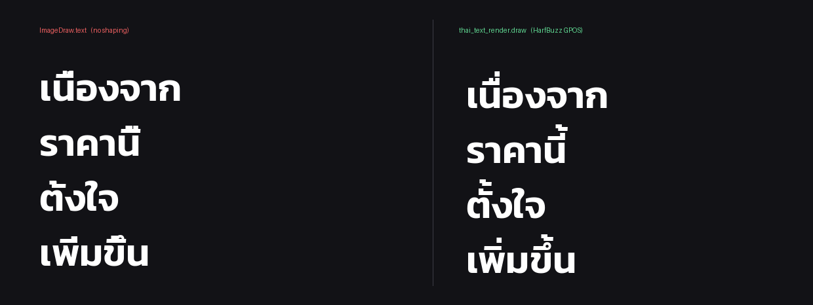

# thai-text-render

[](https://github.com/anthonychkwn/thai-text-render/actions/workflows/ci.yml)

Thai-correct text rendering for Pillow, using HarfBuzz shaping and FreeType rasterization.

## The problem

Pillow only applies complex-script shaping when it was compiled against **libraqm**. Most Windows wheels, and plenty of Linux ones, ship without it. When libraqm is missing, Pillow silently falls back to a naive layout that ignores the font's GPOS table, and Thai loses its stacked marks:

| you wrote | it renders as |
|---|---|
| เนื่อง | เนือง |
| นี้ | นี |
| ตั้ง | ตัง |



The text is still "there" in the sense that no exception is raised. It just quietly comes out misspelled, which is how this ends up shipped in finished video frames and thumbnails before anyone notices.

The same failure mode appears in other renderers that skip mark positioning, `ffmpeg`'s libass subtitle path among them.

## The fix

Shape each line with [uharfbuzz](https://github.com/harfbuzz/uharfbuzz) so the font's GPOS rules run and every mark gets its correct `x_offset` / `y_offset`, rasterize the shaped glyphs with [freetype-py](https://github.com/rougier/freetype-py), then composite onto a PIL canvas.

```python
from PIL import Image
import thai_text_render as ttr

canvas = Image.new("RGBA", (1080, 1920), (0, 0, 0, 255))
ttr.draw(canvas, "เนื่องจากราคานี้", 540, 960,
         "fonts/Kanit-SemiBold.ttf", 72,
         color=(255, 255, 255), glow=8, anchor="mm")
canvas.convert("RGB").save("out.png")
```

## Install

```bash
pip install -r requirements.txt
```

Then point it at any Thai OpenType font (Kanit, Sarabun, Noto Sans Thai, IBM Plex Sans Thai).

## See it for yourself

```bash
python demo.py path/to/ThaiFont.ttf
```

Writes `comparison.png` with the same four strings drawn twice: once through `ImageDraw.text`, once through this module.

```bash
pip install pytest && python -m pytest tests -q
```

The tests render against the first Thai font they can find; set `THAI_FONT` to pick one.

## API

| function | purpose |
|---|---|
| `draw(canvas, text, x, y, font_path, size, ...)` | composite text onto an RGBA canvas |
| `make_layer(text, font_path, size, ...)` | build the standalone RGBA layer (cached) |
| `measure(text, font_path, size, ...)` | `(width, height)` the text would occupy |

`draw` accepts:

- `anchor`: two characters, `[l|m|r][t|m|b]`; `(x, y)` is that anchor point
- `alpha`: `0.0` to `1.0`, applied over the cached layer, so fades cost nothing extra
- `glow` / `glow_color`: Gaussian halo behind the text, padded so the blur fades out instead of ending in a hard rectangle. The anchor still refers to the text, so switching a glow on or off never moves the label
- `tracking`, `line_gap`: letter and line spacing
- multi-line input via `\n`, each line centred

## Built for video

Layers are cached on `(text, font, size, color, glow, tracking, line_gap)`. A subtitle held for two seconds at 30 fps is shaped and rasterized **once**; the other 59 frames only re-apply alpha and position. That is what makes this usable inside a per-frame render loop rather than only for one-off images.

## Notes

- Works for any script that needs shaping, not only Thai. Lao, Khmer, Devanagari and Arabic go through the same path.
- If your Pillow *does* have libraqm, `ImageFont.truetype(..., layout_engine=ImageFont.Layout.RAQM)` is the simpler answer. `demo.py` prints whether your build has it.
- Rendering Thai text into video through `ffmpeg -vf subtitles=` / libass has the same mark-dropping problem and is not fixed by this module. Render the text as images and overlay them.

## License

MIT
